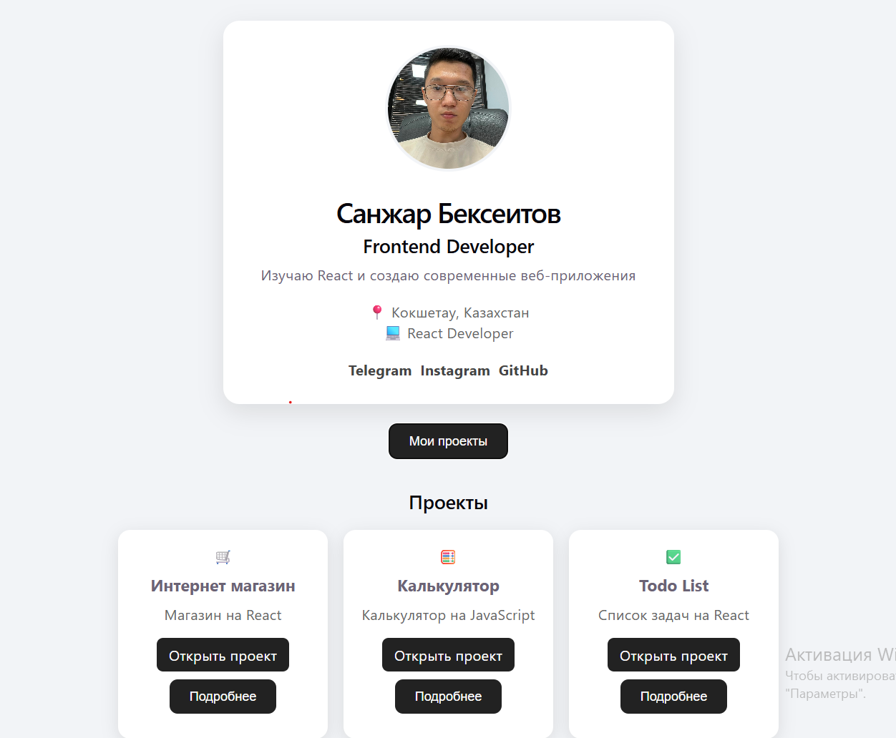

# React Portfolio

> 🚧 Проект находится в разработке. Некоторые разделы и функции ещё не завершены.

Личный сайт-портфолио Frontend-разработчика, созданный на React + Vite.

## 🌐 Демо

Вставь сюда свою ссылку Vercel

## 🚀 Что есть в проекте

- Карточка профиля
- Информация обо мне
- Ссылки на социальные сети
- Раздел с проектами
- Ссылки на отдельные проекты
- Адаптивная верстка
- Современный интерфейс

## 🛠 Технологии

- React
- JavaScript
- HTML
- CSS
- Vite
- Git
- GitHub
- Vercel

## 📸 Скриншоты

### Главная страница

## 📚 Что я изучаю в этом проекте

- React
- Компоненты
- JSX
- Работа с CSS
- Структура React-проекта
- Git и GitHub
- Деплой через Vercel

## ⚠️ Статус проекта

Проект находится в разработке.

Планируется добавить новые секции, улучшить дизайн и обновить список проектов.

## 👨‍💻 Автор

Sanzhar Bekseitov